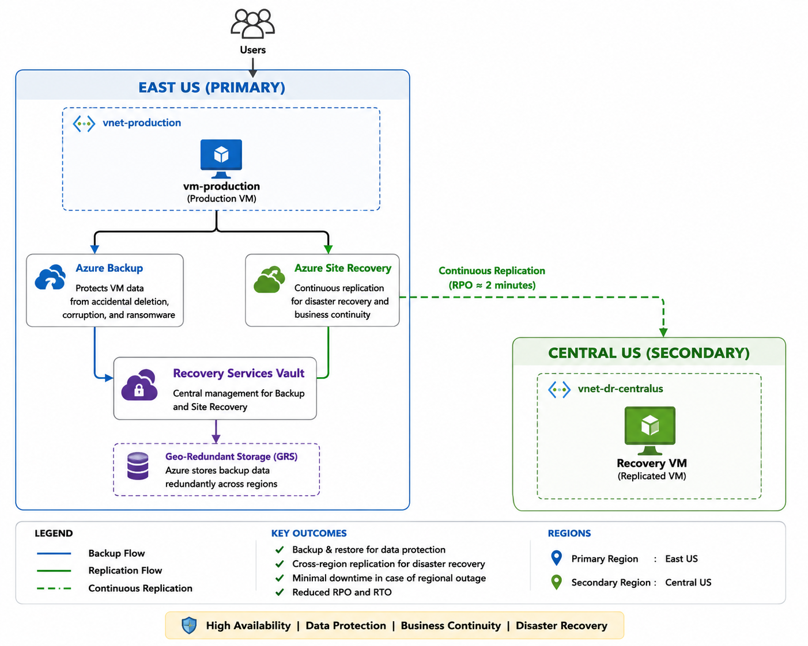

# Project 03 - Multi-Region Disaster Recovery & Backup

> Enterprise Azure Disaster Recovery Solution using Azure Backup and Azure Site Recovery

---

# Project Overview

This project demonstrates the design and implementation of a Business Continuity and Disaster Recovery (BCDR) solution using Microsoft Azure.

The solution protects a production virtual machine hosted in **East US** by combining Azure Backup and Azure Site Recovery to provide backup, replication, and disaster recovery capabilities into **Central US**.

The project follows Microsoft Azure best practices for workload protection and regional disaster recovery.

---

# Business Scenario

An organization hosts its production application in East US.

Management requires a disaster recovery strategy capable of:

- Protecting production workloads
- Recovering from accidental deletion
- Recovering from ransomware
- Recovering from regional outages
- Minimizing downtime
- Reducing data loss

As the Azure Administrator, the objective was to design and implement a complete Disaster Recovery solution.

---

# Solution Architecture

---

# Azure Services Used

- Azure Virtual Machines
- Azure Backup
- Azure Site Recovery
- Recovery Services Vault
- Geo-Redundant Storage (GRS)
- Virtual Networks
- Network Security Groups
- Managed Disks
- Recovery Points

---

# Resources Created

| Resource | Name |
|----------|------|
| Resource Group | rg-dr-lab |
| Recovery Services Vault | rsv-dr-eastus |
| Recovery Services Vault (Site Recovery) | central |
| Virtual Machine | vm-production |
| Virtual Network | vnet-production |
| Network Security Group | nsg-production |
| Public IP | pip-vm-production |

---

# Implementation Phases

## Phase 1

Disaster Recovery Foundation

- Resource Group
- Recovery Services Vault
- Backup Storage Configuration

---

## Phase 2

Production Infrastructure

- Windows Server VM
- Networking
- Diagnostics

---

## Phase 3

Azure Backup

- Backup Policy
- Initial Backup
- Recovery Points

---

## Phase 4

Azure Site Recovery

- Replication
- Protection
- Replication Policy
- Cross-region configuration

---

## Phase 5

Testing

- Test Failover
- Recovery Validation
- Site Recovery Jobs

---

# Testing Performed

✅ VM Backup

✅ Recovery Point Created

✅ Replication Enabled

✅ Replication Health Verified

✅ Test Failover Successful

✅ Site Recovery Jobs Successful

---

# Project Outcomes

Successfully implemented an enterprise disaster recovery solution capable of:

- Protecting production workloads
- Replicating workloads across Azure regions
- Performing non-disruptive disaster recovery testing
- Reducing Recovery Time Objective (RTO)
- Reducing Recovery Point Objective (RPO)

---

# Key Skills Demonstrated

- Azure Administration
- Azure Backup
- Azure Site Recovery
- Disaster Recovery
- Business Continuity
- Azure Virtual Machines
- High Availability
- Recovery Services Vault
- Geo-Redundant Storage
- Enterprise Infrastructure

---

# Lessons Learned

- Difference between Backup and Disaster Recovery
- Azure Site Recovery architecture
- Geo-Redundant Storage
- Replication Policies
- Recovery Point Objective (RPO)
- Recovery Time Objective (RTO)
- Enterprise Disaster Recovery Design

---

# Future Improvements

- Recovery Plans
- Azure Monitor Alerts
- Azure Automation Runbooks
- Azure Traffic Manager
- Azure Front Door
- Automated Failover Testing

---

# Author

**Benjamin Okeh**

Azure Administrator | Cloud Infrastructure Engineer

GitHub Portfolio Project